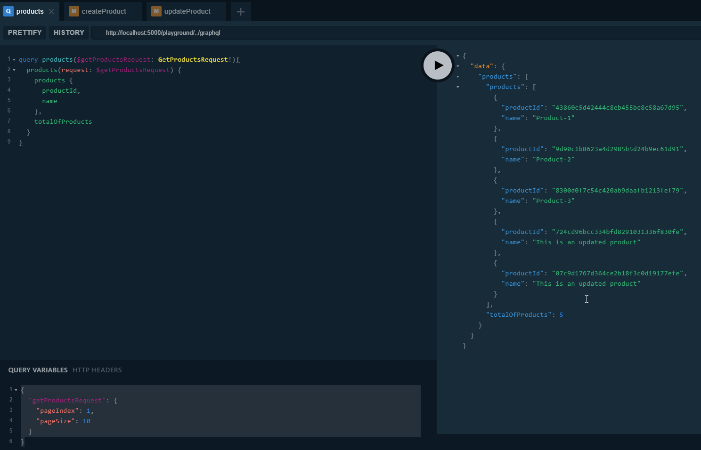

# simple-microservices
An example of building micro-services by .NET Core

## Getting started

### Step 1

```cmd
docker-compose -f docker-compose.yml -f docker-compose.override.yml up -d
```

_To see the logs_

```cmd
docker-compose -f docker-compose.yml -f docker-compose.override.yml logs -f
```

To exit the interactive mode use `Ctrl + C`

### Step 2

```cmd
dotnet run -p .\src\Services\ProductCatalog\SimpleStore.ProductCatalogApi\SimpleStore.ProductCatalogApi.csproj
```

```cmd
dotnet run -p .\src\Services\Inventories\SimpleStore.InventoriesApi\SimpleStore.InventoriesApi.csproj
```

```cmd
dotnet run -p .\src\Services\GraphQL\SimpleStore.GraphQLApi\SimpleStore.GraphQLApi.csproj
```

### Step 3

- Go to `http://localhost:5000`

#### Query Products

**Query**

```js
query getProductsInCatalog($request: product_catalog_api_GetProductsRequest!) {
  product_catalog_api_GetProducts(request: $request) {
    totalOfProducts,
    products {
      productId, 
      name
    }
  }
}
```

**Variable**

```js
{
  "request": {
    "pageIndex": 1,
    "pageSize": 10
  }
}
```



#### Create new product

**Mutation**

```js
mutation createProduct($createProductRequest: CreateProductRequest!){
  CreateProduct(request: $createProductRequest){
    productId,
    name
  }
}
```

**Variable**
```js
{
  "createProductRequest":{
    "productName": "Hello Hello"
  }
}
```


#### Update Existing Product

**Mutation**

```js
mutation updateProduct($updateProductRequest: UpdateProductRequest!){
  UpdateProduct(request: $updateProductRequest){
    productId,
    name
  }
}
```

**Variable**

```js
{
  "updateProductRequest": {
    "productId": "07c9d1767d364ce2b18f3c0d19177efe",
    "newProductName": "This is an updated product"
  }
}
```


## Histories

1. [Resolve Issue #1](https://github.com/kimcu-on-thenet/simple-microservices/issues/1)
- Add [Serilog.AspNetCore](https://github.com/serilog/serilog-aspnetcore)
- Implement a custom TypeConverter & JsonConverter in order to serve for StronglyType-Id => see the issue [#3](https://github.com/kimcu-on-thenet/simple-microservices/issues/3)

2. [Resolve Issue #6](https://github.com/kimcu-on-thenet/simple-microservices/issues/6) => Enable GraphQL for **ProductCatalogApi** and define **GraphQLApi**
  - ProductCatalog
    - Define the following requests:
      - GetProductsRequest
      - CreateProductRequest
      - UpdateProductRequest
    - Define `InputObject`, `ObjectType`, `QueryType` & `MutationType` classes
  - GraphQL
      - Use **StitchedSchema** functionality
  - Use sharing Settings by following the [blog](https://andrewlock.net/sharing-appsettings-json-configuration-files-between-projects-in-asp-net-core/)
3. [Resolve Issue #8](https://github.com/kimcu-on-thenet/simple-microservices/issues/8)
  - Define **InventoryApi**

## Notes

### Add migration for EntityFrameworkCore

1. Via **Package Manager Console**

```powershell
Add-Migration Add_Product -Project src\Services\ProductCatalog\SimpleStore.ProductCatalog.Infrastructure.EfCore -StartupProject src\Services\ProductCatalog\SimpleStore.ProductCatalogApi
```

2. Via dotnet ef cli

```cmd
dotnet ef migrations add Add_Product --project src\Services\ProductCatalog\SimpleStore.ProductCatalog.Infrastructure.EfCore --startup-project src\Services\ProductCatalog\SimpleStore.ProductCatalogApi
```

3. Resources

- [Entity Framework Core tools reference - Package Manager Console in Visual Studio](https://docs.microsoft.com/en-us/ef/core/miscellaneous/cli/powershell)